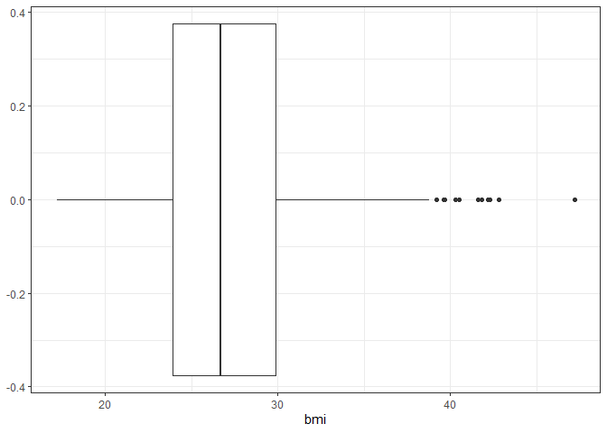

-   [Set up](#set-up)
    -   [Read data](#read-data)
    -   [Univariate display of data](#univariate-display-of-data)
-   [Set t](#set-t)

Set up
======

Set up packages and path to the data set.

``` r
library(rmarkdown)
library(ggplot2)
library(dplyr)
```

    ## 
    ## Attaching package: 'dplyr'

    ## The following objects are masked from 'package:stats':
    ## 
    ##     filter, lag

    ## The following objects are masked from 'package:base':
    ## 
    ##     intersect, setdiff, setequal, union

``` r
library(Hmisc)
```

    ## Loading required package: lattice

    ## Loading required package: survival

    ## Loading required package: Formula

    ## 
    ## Attaching package: 'Hmisc'

    ## The following objects are masked from 'package:dplyr':
    ## 
    ##     src, summarize

    ## The following objects are masked from 'package:base':
    ## 
    ##     format.pval, units

``` r
library(here)
```

    ## here() starts at C:/R/ida-regression

``` r
## Relative path to the data set
crs_data_path = here("data", "crs.Rdata")
```

Read data
---------

Load the CRS dataset.

``` r
load(crs_data_path)
```

Univariate display of data
--------------------------

``` r
crs %>%
  ggplot(aes(y = bmi)) +
  geom_boxplot() +
  coord_flip() +
  theme_bw()
```



Set t
=====
