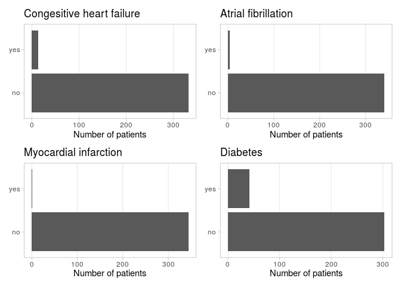
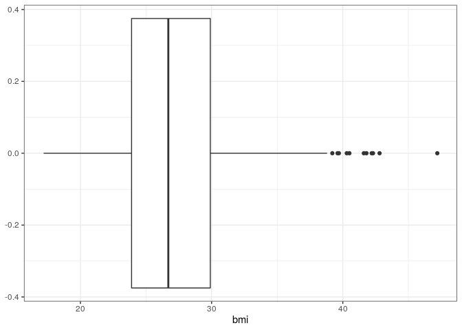

# Read data

Assumptions:

  - Basic reporting
  - To aim at level 1 and 2, less emphasis on code modularity (i.e. user
    defined functions)
  - Code to be simple, readable, extendable.

TODO: add variable to indicate measurement type: \* MH \* cormodoities
\* outcome Add additional metadata on measurement timing

## Set up

Set up packages and path to the data set.

``` r
library(rmarkdown)
library(ggplot2)
library(dplyr)
```

    ## 
    ## Attaching package: 'dplyr'

    ## The following objects are masked from 'package:stats':
    ## 
    ##     filter, lag

    ## The following objects are masked from 'package:base':
    ## 
    ##     intersect, setdiff, setequal, union

``` r
library(Hmisc)
```

    ## Loading required package: lattice

    ## Loading required package: survival

    ## Loading required package: Formula

    ## 
    ## Attaching package: 'Hmisc'

    ## The following objects are masked from 'package:dplyr':
    ## 
    ##     src, summarize

    ## The following objects are masked from 'package:base':
    ## 
    ##     format.pval, units

``` r
library(forcats)
library(patchwork)
library(here)
```

    ## here() starts at /cloud/project

``` r
library(skimr)


## Set global ggplot theme
theme_set(theme_light())

## Relative path to the data set
crs_data_path = here("data", "crs.Rdata")
```

## Read data

Load the CRS dataset.

``` r
load(crs_data_path)
```

## Check data

Check data contents and complete any misssing information including
labels or units.

display the data set contents.

``` r
Hmisc::contents(crs) 
```

    ## 
    ## Data frame:crs   345 observations and 44 variables    Maximum # NAs:268
    ## 
    ## 
    ##                                                                      Labels
    ## id                                                   identifier of patients
    ## los                                                          length of stay
    ## agenew                                                       age at surgery
    ## sex                                                                     sex
    ## bmi                                                                        
    ## asa             American Society of Anesthesiologists physical status score
    ## priorabdsurgery                                     prior abdominal surgery
    ## mis                                                minimal invasive surgery
    ## preopxrt                                             preoperative radiation
    ## preopchemo                                        preoperative chemotherapy
    ## readmit30                           readmisison within 30 days post surgery
    ## death30                                   death within 30 days post surgery
    ## anemiatransf                                   blood transfusion for anemia
    ## afib                                                  arterial fibrillation
    ## chf                                               congesitive heart failure
    ## mi                                                     myocardio infarction
    ## dvtpe                                                deep venous thrombosis
    ## arf                                                       arrthymia failure
    ## respfail                                                respiratory failure
    ## ileus                               partial small bowel obstruction (ileus)
    ## sboreop                                                                    
    ## reopbleed                             reoperation for bleeding complication
    ## winfect                                                     wound infection
    ## abscessleak                                                 abscess or leak
    ## pneumonia                                                                  
    ## uti                                                 urinary tract infection
    ## day1stbm                                       days to first bowel movement
    ## primaryproc                                               primary procedure
    ## diabetes                                                           diabetes
    ## hf                                                                         
    ## pvd                                                            pulmonary vd
    ## copd                                                                   COPD
    ## renal                                  acute or chronic renal insufficiency
    ## tobaccoever                                                    smoking ever
    ## tobaccocurrent                                              smoking current
    ## crohn                                                       Crohn's disease
    ## ulcercol                                                  ulceratie colitis
    ## ibd                                              inflammatory bowel disease
    ## t2comp                                           days to first complication
    ## comp                                                          complications
    ## t2comp_pre                      days to first complication before dismissal
    ## comp_pre                                      complication before dismissal
    ## num_comp                                            number of complications
    ## dc2fu                                                     days to follow-up
    ##                 Units Levels     Class   Storage NAs
    ## id                           character character   0
    ## los              days          integer   integer   0
    ## agenew          years          numeric    double   0
    ## sex                        2             integer   0
    ## bmi                                       double   0
    ## asa                        4             integer   0
    ## priorabdsurgery            2             integer   0
    ## mis                        2             integer   0
    ## preopxrt                   2             integer   0
    ## preopchemo                 2             integer   0
    ## readmit30                  2             integer   0
    ## death30                    2             integer   0
    ## anemiatransf               2             integer   0
    ## afib                       2             integer   0
    ## chf                        2             integer   0
    ## mi                         2             integer   0
    ## dvtpe                      2             integer   0
    ## arf                        2             integer   0
    ## respfail                   2             integer   0
    ## ileus                      2             integer   0
    ## sboreop                    2             integer   0
    ## reopbleed                  2             integer   0
    ## winfect                    2             integer   0
    ## abscessleak                2             integer   0
    ## pneumonia                  2             integer   0
    ## uti                        2             integer   0
    ## day1stbm         days          integer   integer  40
    ## primaryproc                3             integer   0
    ## diabetes                   2             integer   0
    ## hf                         2             integer   0
    ## pvd                        2             integer   0
    ## copd                       2             integer   0
    ## renal                      2             integer   0
    ## tobaccoever                2             integer   0
    ## tobaccocurrent             2             integer   0
    ## crohn                      2             integer   0
    ## ulcercol                   2             integer   0
    ## ibd                        2             integer   0
    ## t2comp           days          integer   integer 244
    ## comp                       2             integer   0
    ## t2comp_pre       days          integer   integer 268
    ## comp_pre                   2             integer   0
    ## num_comp                       integer   integer   0
    ## dc2fu            days          integer   integer   0
    ## 
    ## +---------------+-----------------------+
    ## |Variable       |Levels                 |
    ## +---------------+-----------------------+
    ## |sex            |female,male            |
    ## +---------------+-----------------------+
    ## |asa            |1,2,3,4                |
    ## +---------------+-----------------------+
    ## |priorabdsurgery|0,1                    |
    ## |mis            |                       |
    ## |preopxrt       |                       |
    ## |preopchemo     |                       |
    ## |readmit30      |                       |
    ## |death30        |                       |
    ## |anemiatransf   |                       |
    ## |afib           |                       |
    ## |chf            |                       |
    ## |mi             |                       |
    ## |dvtpe          |                       |
    ## |arf            |                       |
    ## |respfail       |                       |
    ## |ileus          |                       |
    ## |sboreop        |                       |
    ## |reopbleed      |                       |
    ## |winfect        |                       |
    ## |abscessleak    |                       |
    ## |pneumonia      |                       |
    ## |uti            |                       |
    ## |diabetes       |                       |
    ## |hf             |                       |
    ## |pvd            |                       |
    ## |copd           |                       |
    ## |renal          |                       |
    ## |tobaccoever    |                       |
    ## |tobaccocurrent |                       |
    ## |crohn          |                       |
    ## |ulcercol       |                       |
    ## |ibd            |                       |
    ## |comp           |                       |
    ## |comp_pre       |                       |
    ## +---------------+-----------------------+
    ## |primaryproc    |LAR,APR,Proctocolectomy|
    ## +---------------+-----------------------+

Add missing label for BMI.

``` r
crs <- crs %>%
  Hmisc::upData(labels = c(bmi = 'body mass index'))
```

    ## Input object size:    124504 bytes;   44 variables    345 observations
    ## New object size: 123656 bytes;   44 variables    345 observations

``` r
crs %>% describe()
```

    ## . 
    ## 
    ##  44  Variables      345  Observations
    ## --------------------------------------------------------------------------------
    ## id : identifier of patients 
    ##        n  missing distinct 
    ##      345        0      345 
    ## 
    ## lowest : 1   10  100 101 102, highest: 95  96  97  98  99 
    ## --------------------------------------------------------------------------------
    ## los : length of stay [days] 
    ##        n  missing distinct     Info     Mean      Gmd      .05      .10 
    ##      345        0       23    0.976    5.678    3.671        2        3 
    ##      .25      .50      .75      .90      .95 
    ##        3        5        6       10       13 
    ## 
    ## lowest :  2  3  4  5  6, highest: 21 23 24 26 32
    ## --------------------------------------------------------------------------------
    ## agenew : age at surgery [years] 
    ##        n  missing distinct     Info     Mean      Gmd      .05      .10 
    ##      345        0       62    0.999    59.12    15.52     37.0     41.4 
    ##      .25      .50      .75      .90      .95 
    ##     51.0     60.0     69.0     76.0     80.6 
    ## 
    ## lowest : 16 18 23 26 27, highest: 85 86 87 88 90
    ## --------------------------------------------------------------------------------
    ## sex 
    ##        n  missing distinct 
    ##      345        0        2 
    ##                         
    ## Value      female   male
    ## Frequency     110    235
    ## Proportion  0.319  0.681
    ## --------------------------------------------------------------------------------
    ## bmi : body mass index 
    ##        n  missing distinct     Info     Mean      Gmd      .05      .10 
    ##      345        0      156        1    27.27    5.425    20.60    21.34 
    ##      .25      .50      .75      .90      .95 
    ##    23.90    26.70    29.90    33.46    36.60 
    ## 
    ## lowest : 17.2 17.9 18.3 18.5 19.0, highest: 41.8 42.2 42.3 42.8 47.2
    ## --------------------------------------------------------------------------------
    ## asa : American Society of Anesthesiologists physical status score 
    ##        n  missing distinct 
    ##      345        0        4 
    ##                                   
    ## Value          1     2     3     4
    ## Frequency     16   234    93     2
    ## Proportion 0.046 0.678 0.270 0.006
    ## --------------------------------------------------------------------------------
    ## priorabdsurgery : prior abdominal surgery 
    ##        n  missing distinct 
    ##      345        0        2 
    ##                       
    ## Value          0     1
    ## Frequency    257    88
    ## Proportion 0.745 0.255
    ## --------------------------------------------------------------------------------
    ## mis : minimal invasive surgery 
    ##        n  missing distinct 
    ##      345        0        2 
    ##                       
    ## Value          0     1
    ## Frequency    217   128
    ## Proportion 0.629 0.371
    ## --------------------------------------------------------------------------------
    ## preopxrt : preoperative radiation 
    ##        n  missing distinct 
    ##      345        0        2 
    ##                       
    ## Value          0     1
    ## Frequency    189   156
    ## Proportion 0.548 0.452
    ## --------------------------------------------------------------------------------
    ## preopchemo : preoperative chemotherapy 
    ##        n  missing distinct 
    ##      345        0        2 
    ##                       
    ## Value          0     1
    ## Frequency    185   160
    ## Proportion 0.536 0.464
    ## --------------------------------------------------------------------------------
    ## readmit30 : readmisison within 30 days post surgery 
    ##        n  missing distinct 
    ##      345        0        2 
    ##                       
    ## Value          0     1
    ## Frequency    302    43
    ## Proportion 0.875 0.125
    ## --------------------------------------------------------------------------------
    ## death30 : death within 30 days post surgery 
    ##        n  missing distinct 
    ##      345        0        2 
    ##                       
    ## Value          0     1
    ## Frequency    343     2
    ## Proportion 0.994 0.006
    ## --------------------------------------------------------------------------------
    ## anemiatransf : blood transfusion for anemia 
    ##        n  missing distinct 
    ##      345        0        2 
    ##                       
    ## Value          0     1
    ## Frequency    310    35
    ## Proportion 0.899 0.101
    ## --------------------------------------------------------------------------------
    ## afib : arterial fibrillation 
    ##        n  missing distinct 
    ##      345        0        2 
    ##                       
    ## Value          0     1
    ## Frequency    341     4
    ## Proportion 0.988 0.012
    ## --------------------------------------------------------------------------------
    ## chf : congesitive heart failure 
    ##        n  missing distinct 
    ##      345        0        2 
    ##                       
    ## Value          0     1
    ## Frequency    332    13
    ## Proportion 0.962 0.038
    ## --------------------------------------------------------------------------------
    ## mi : myocardio infarction 
    ##        n  missing distinct 
    ##      345        0        2 
    ##                       
    ## Value          0     1
    ## Frequency    344     1
    ## Proportion 0.997 0.003
    ## --------------------------------------------------------------------------------
    ## dvtpe : deep venous thrombosis 
    ##        n  missing distinct 
    ##      345        0        2 
    ##                       
    ## Value          0     1
    ## Frequency    337     8
    ## Proportion 0.977 0.023
    ## --------------------------------------------------------------------------------
    ## arf : arrthymia failure 
    ##        n  missing distinct 
    ##      345        0        2 
    ##                       
    ## Value          0     1
    ## Frequency    336     9
    ## Proportion 0.974 0.026
    ## --------------------------------------------------------------------------------
    ## respfail : respiratory failure 
    ##        n  missing distinct 
    ##      345        0        2 
    ##                       
    ## Value          0     1
    ## Frequency    343     2
    ## Proportion 0.994 0.006
    ## --------------------------------------------------------------------------------
    ## ileus : partial small bowel obstruction (ileus) 
    ##        n  missing distinct 
    ##      345        0        2 
    ##                       
    ## Value          0     1
    ## Frequency    264    81
    ## Proportion 0.765 0.235
    ## --------------------------------------------------------------------------------
    ## sboreop 
    ##        n  missing distinct 
    ##      345        0        2 
    ##                       
    ## Value          0     1
    ## Frequency    341     4
    ## Proportion 0.988 0.012
    ## --------------------------------------------------------------------------------
    ## reopbleed : reoperation for bleeding complication 
    ##        n  missing distinct 
    ##      345        0        2 
    ##                       
    ## Value          0     1
    ## Frequency    343     2
    ## Proportion 0.994 0.006
    ## --------------------------------------------------------------------------------
    ## winfect : wound infection 
    ##        n  missing distinct 
    ##      345        0        2 
    ##                       
    ## Value          0     1
    ## Frequency    332    13
    ## Proportion 0.962 0.038
    ## --------------------------------------------------------------------------------
    ## abscessleak : abscess or leak 
    ##        n  missing distinct 
    ##      345        0        2 
    ##                       
    ## Value          0     1
    ## Frequency    322    23
    ## Proportion 0.933 0.067
    ## --------------------------------------------------------------------------------
    ## pneumonia 
    ##        n  missing distinct 
    ##      345        0        2 
    ##                       
    ## Value          0     1
    ## Frequency    341     4
    ## Proportion 0.988 0.012
    ## --------------------------------------------------------------------------------
    ## uti : urinary tract infection 
    ##        n  missing distinct 
    ##      345        0        2 
    ##                       
    ## Value          0     1
    ## Frequency    329    16
    ## Proportion 0.954 0.046
    ## --------------------------------------------------------------------------------
    ## day1stbm : days to first bowel movement [days] 
    ##        n  missing distinct     Info     Mean      Gmd      .05      .10 
    ##      305       40       12    0.934    2.672    1.728        1        1 
    ##      .25      .50      .75      .90      .95 
    ##        2        2        3        5        6 
    ## 
    ## lowest :  0  1  2  3  4, highest:  7  8  9 10 12
    ##                                                                             
    ## Value          0     1     2     3     4     5     6     7     8     9    10
    ## Frequency      2    69   109    59    33     9    12     3     5     1     2
    ## Proportion 0.007 0.226 0.357 0.193 0.108 0.030 0.039 0.010 0.016 0.003 0.007
    ##                 
    ## Value         12
    ## Frequency      1
    ## Proportion 0.003
    ## --------------------------------------------------------------------------------
    ## primaryproc : primary procedure 
    ##        n  missing distinct 
    ##      345        0        3 
    ##                                                           
    ## Value                  LAR             APR Proctocolectomy
    ## Frequency              249              68              28
    ## Proportion           0.722           0.197           0.081
    ## --------------------------------------------------------------------------------
    ## diabetes 
    ##        n  missing distinct 
    ##      345        0        2 
    ##                       
    ## Value          0     1
    ## Frequency    303    42
    ## Proportion 0.878 0.122
    ## --------------------------------------------------------------------------------
    ## hf 
    ##        n  missing distinct 
    ##      345        0        2 
    ##                       
    ## Value          0     1
    ## Frequency    340     5
    ## Proportion 0.986 0.014
    ## --------------------------------------------------------------------------------
    ## pvd : pulmonary vd 
    ##        n  missing distinct 
    ##      345        0        2 
    ##                       
    ## Value          0     1
    ## Frequency    341     4
    ## Proportion 0.988 0.012
    ## --------------------------------------------------------------------------------
    ## copd : COPD 
    ##        n  missing distinct 
    ##      345        0        2 
    ##                     
    ## Value         0    1
    ## Frequency   314   31
    ## Proportion 0.91 0.09
    ## --------------------------------------------------------------------------------
    ## renal : acute or chronic renal insufficiency 
    ##        n  missing distinct 
    ##      345        0        2 
    ##                       
    ## Value          0     1
    ## Frequency    334    11
    ## Proportion 0.968 0.032
    ## --------------------------------------------------------------------------------
    ## tobaccoever : smoking ever 
    ##        n  missing distinct 
    ##      345        0        2 
    ##                       
    ## Value          0     1
    ## Frequency    268    77
    ## Proportion 0.777 0.223
    ## --------------------------------------------------------------------------------
    ## tobaccocurrent : smoking current 
    ##        n  missing distinct 
    ##      345        0        2 
    ##                       
    ## Value          0     1
    ## Frequency    313    32
    ## Proportion 0.907 0.093
    ## --------------------------------------------------------------------------------
    ## crohn : Crohn's disease 
    ##        n  missing distinct 
    ##      345        0        2 
    ##                       
    ## Value          0     1
    ## Frequency    343     2
    ## Proportion 0.994 0.006
    ## --------------------------------------------------------------------------------
    ## ulcercol : ulceratie colitis 
    ##        n  missing distinct 
    ##      345        0        2 
    ##                       
    ## Value          0     1
    ## Frequency    337     8
    ## Proportion 0.977 0.023
    ## --------------------------------------------------------------------------------
    ## ibd : inflammatory bowel disease 
    ##        n  missing distinct 
    ##      345        0        2 
    ##                       
    ## Value          0     1
    ## Frequency    335    10
    ## Proportion 0.971 0.029
    ## --------------------------------------------------------------------------------
    ## t2comp : days to first complication [days] 
    ##        n  missing distinct     Info     Mean      Gmd      .05      .10 
    ##      101      244       26    0.981     8.01     9.01        1        2 
    ##      .25      .50      .75      .90      .95 
    ##        3        4        7       19       30 
    ## 
    ## lowest :  0  1  2  3  4, highest: 32 36 41 44 96
    ## --------------------------------------------------------------------------------
    ## comp : complications 
    ##        n  missing distinct 
    ##      345        0        2 
    ##                       
    ## Value          0     1
    ## Frequency    244   101
    ## Proportion 0.707 0.293
    ## --------------------------------------------------------------------------------
    ## t2comp_pre : days to first complication before dismissal [days] 
    ##        n  missing distinct     Info     Mean      Gmd      .05      .10 
    ##       77      268       10    0.962    3.649    2.079        1        1 
    ##      .25      .50      .75      .90      .95 
    ##        3        3        5        6        7 
    ## 
    ## lowest : 0 1 2 3 4, highest: 5 6 7 8 9
    ##                                                                       
    ## Value          0     1     2     3     4     5     6     7     8     9
    ## Frequency      3     6     9    22    17     8     5     4     2     1
    ## Proportion 0.039 0.078 0.117 0.286 0.221 0.104 0.065 0.052 0.026 0.013
    ## --------------------------------------------------------------------------------
    ## comp_pre : complication before dismissal 
    ##        n  missing distinct 
    ##      345        0        2 
    ##                       
    ## Value          0     1
    ## Frequency    268    77
    ## Proportion 0.777 0.223
    ## --------------------------------------------------------------------------------
    ## num_comp : number of complications 
    ##        n  missing distinct     Info     Mean      Gmd 
    ##      345        0        4    0.634   0.3681   0.5574 
    ##                                   
    ## Value          0     1     2     3
    ## Frequency    244    78    20     3
    ## Proportion 0.707 0.226 0.058 0.009
    ## --------------------------------------------------------------------------------
    ## dc2fu : days to follow-up [days] 
    ##        n  missing distinct     Info     Mean      Gmd      .05      .10 
    ##      345        0      318        1    792.3    692.1     29.4     68.4 
    ##      .25      .50      .75      .90      .95 
    ##    255.0    663.0   1297.0   1690.4   1895.6 
    ## 
    ## lowest :    0    1    2   14   15, highest: 2181 2191 2229 2257 2281
    ## --------------------------------------------------------------------------------

# Univariate data display

## Medical history

A summary of medical history measured at *diagnosis* (TODO: check when
medical history / comorbidities was assessed).

AFib, MI and CHF.

``` r
crs %>% 
  select(chf, afib, mi, diabetes) %>%
  Hmisc::describe()
```

    ## . 
    ## 
    ##  4  Variables      345  Observations
    ## --------------------------------------------------------------------------------
    ## chf : congesitive heart failure 
    ##        n  missing distinct 
    ##      345        0        2 
    ##                       
    ## Value          0     1
    ## Frequency    332    13
    ## Proportion 0.962 0.038
    ## --------------------------------------------------------------------------------
    ## afib : arterial fibrillation 
    ##        n  missing distinct 
    ##      345        0        2 
    ##                       
    ## Value          0     1
    ## Frequency    341     4
    ## Proportion 0.988 0.012
    ## --------------------------------------------------------------------------------
    ## mi : myocardio infarction 
    ##        n  missing distinct 
    ##      345        0        2 
    ##                       
    ## Value          0     1
    ## Frequency    344     1
    ## Proportion 0.997 0.003
    ## --------------------------------------------------------------------------------
    ## diabetes 
    ##        n  missing distinct 
    ##      345        0        2 
    ##                       
    ## Value          0     1
    ## Frequency    303    42
    ## Proportion 0.878 0.122
    ## --------------------------------------------------------------------------------

``` r
## TODO: Turn this in to a function
gg_chf <- 
  crs %>%
  select(chf) %>%
  mutate(chf = fct_recode(chf,
                          "no" = "0",
                          "yes"   = "1")) %>%
  ggplot(aes(chf)) +
  geom_bar() +
  coord_flip() +
  ggtitle("Congesitive heart failure") +
  ylab("Number of patients") +
  theme(
    panel.grid.minor = element_blank(),
    panel.grid.major.y = element_blank(),
    axis.title.y = element_blank()
  )
```

``` r
gg_afib <- 
  crs %>%
  select(afib) %>%
  mutate(afib = fct_recode(afib,
                          "no" = "0",
                          "yes"   = "1")) %>%
  ggplot(aes(afib)) +
  geom_bar() +
  coord_flip() +
  ggtitle("Atrial fibrillation") +
  ylab("Number of patients") +
  theme(
    panel.grid.minor = element_blank(),
    panel.grid.major.y = element_blank(),
    axis.title.y = element_blank()
  )
```

``` r
gg_mi <- 
  crs %>%
  select(mi) %>%
  mutate(mi = fct_recode(mi,
                          "no" = "0",
                          "yes"   = "1")) %>%
  ggplot(aes(mi)) +
  geom_bar() +
  coord_flip() +
  ggtitle("Myocardial infarction") +
  ylab("Number of patients") +
  theme(
    panel.grid.minor = element_blank(),
    panel.grid.major.y = element_blank(),
    axis.title.y = element_blank()
  )
```

Diabetes (type 1 and type2?)

``` r
gg_dia <- 
  crs %>%
  select(diabetes) %>%
  mutate(diabetes = fct_recode(diabetes,
                          "no" = "0",
                          "yes"   = "1")) %>%
  ggplot(aes(diabetes)) +
  geom_bar() +
  coord_flip() +
  ggtitle("Diabetes") +
  ylab("Number of patients") +
  theme(
    panel.grid.minor = element_blank(),
    panel.grid.major.y = element_blank(),
    axis.title.y = element_blank()
  )
```

Plot of the distribution of patients with specific comorbidities
measured at diagnosis.

``` r
(gg_chf + gg_afib) / (gg_mi + gg_dia)
```

<!-- -->

## Patient characteristics

``` r
gg1 <- crs %>%
  ggplot(aes(y = bmi)) +
  geom_boxplot() +
  coord_flip() +
  theme_bw()
```

``` r
gg1 
```

<!-- -->

# Bivariate data display
